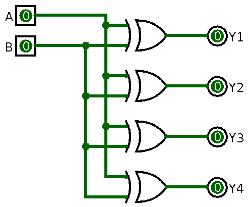
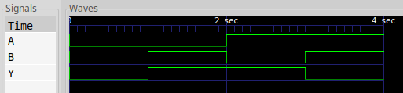
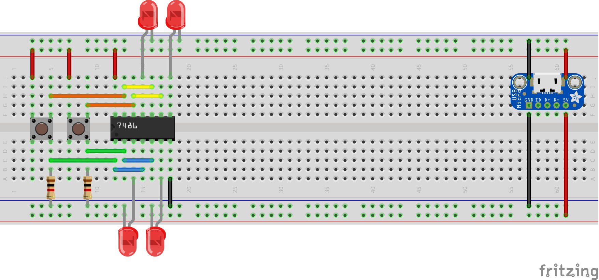
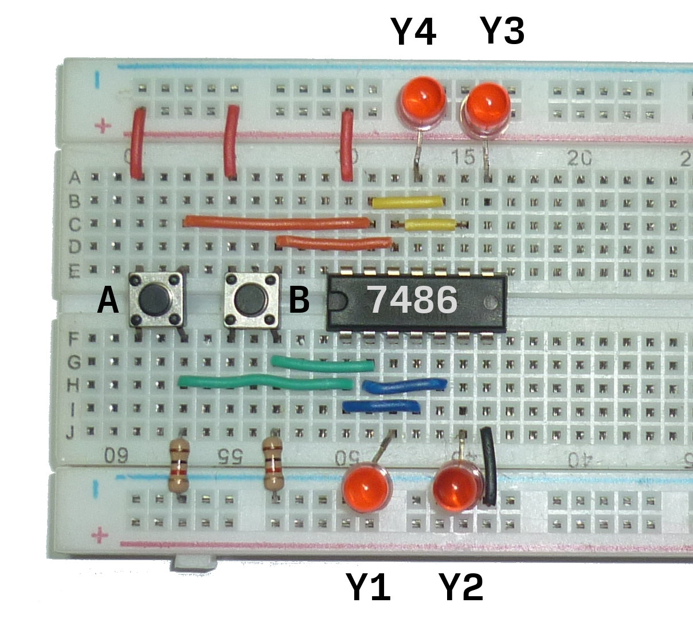
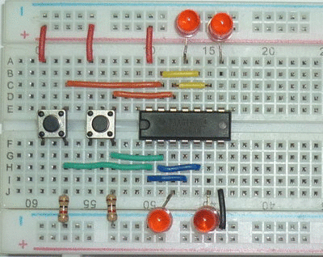

# Pendahuluan

Rangkaian ini bertujuan untuk menguji kebenaran IC 74LS86.
IC 74LS86 adalah IC logika digital yang menyediakan 4 gerbang logika XOR.
IC ini memiliki 14 pin dalam bentuk *dual-inline package* (DIP).

Pertama, dilakukan simulasi terlebih dahulu pada Logisim dan Verilog.
Kemudian, layout rangkaian dirancang dengan menggunakan Fritzing.
Akhirnya, rangkaian diimplementasikan menggunakan *breadboard* dengan *power supply* dari USB.


# Simulasi Logisim

## Skema rangkaian

Berikut skema rangkaian untuk pengujian IC logika 7486 XOR.
Berkas simulasi dapat diunduh di [xor-test.circ](xor-test.circ).



## Tabel kebenaran

Berikut adalah tabel kebenaran dari simulasi rangkaian di atas.

| A | B | Y1 | Y2 | Y3 | Y4 |
| :-: | :-: | :-: | :-: | :-: | :-: |
| 0 | 0 | 0  | 0  | 0  | 0  |
| 0 | 1 | 1  | 1  | 1  | 1  |
| 1 | 0 | 1  | 1  | 1  | 1  |
| 1 | 1 | 0  | 0  | 0  | 0  |

# Simulasi Verilog

## Kode Verilog

Berikut kode Verilog yang mendeskripsikan rangkaian ini.
Terdapat dua modul, yaitu modul `_xor` untuk deskripsi gerbang logika XOR dan modul pengujian `_xor_test`.
Pada modul `_xor`, digunakan *assignment* dengan operator biner `^` untuk XOR.
Operator lainnya adalah: `&`, `|`, dan `~` untuk AND, OR, dan NOT.
Lalu, pada modul `_xor_test`, modul `_xor` dijalankan selama 4 detik, dengan perubahan nilai masukan A atau B tiap 1 detik.
Semua nilai keluaran di-*dump* ke dalam berkas `dump.vcd`, yang dapat dilihat dengan GtkWave.

```verilog
module _xor(A, B, Y);
    input   A, B;
    output  Y;
    assign  Y = A ^ B;
endmodule

module _xor_test;
    reg     A, B;
    wire    Y;
    _xor    T(A, B, Y);

    initial begin
        $dumpvars;
        $monitor("%d %d | %d", A, B, Y);
        A = 0; B = 0;
    #1  A = 0; B = 1;
    #1  A = 1; B = 0;
    #1  A = 1; B = 1;
    #1  $finish;
    end
endmodule
```

## Diagram Waktu

Berikut tampilan diagram waktu hasil keluaran dari simulasi Verilog di atas.




# Implementasi

## Skema Breadboard

Berikut skema *breadboard* untuk implementasi pengujian gerbang logika XOR.
Catu daya diambil dari USB, karena IC 74LS memerlukan tegangan sebesar 5 Volt.
Skema ini dapat diunduh di [xor-test.fzz](xor-test.fzz).



## Hasil dan Pembahasan

Semua gerbang logika XOR pada IC 74LS86 berfungsi dengan baik.
Masukan berupa dua saklar, jika saklar ditekan maka masukan bernilai 1, sebaliknya bernilai 0.
Keluaran berupa empat lampu LED, jika lampu menyala maka keluaran bernilai 1, sebaliknya bernilai 0.
Berikut tabel pengujian IC 74LS86 pada *breadboard*, serta foto rangkaian tersebut.

| A | B | Y1 | Y2 | Y3 | Y4 |
| :-: | :-: | :-: | :-: | :-: | :-: |
| 0 | 0 | 0  | 0  | 0  | 0  |
| 0 | 1 | 1  | 1  | 1  | 1  |
| 1 | 0 | 1  | 1  | 1  | 1  |
| 1 | 1 | 0  | 0  | 0  | 0  |






# Penutup

Rangkaian ini berhasil menguji kebenaran kinerja IC 74LS86.
Dari hasil eksperiman, keluaran IC sesuai dengan tabel kebenaran untuk gerbang logika XOR.
